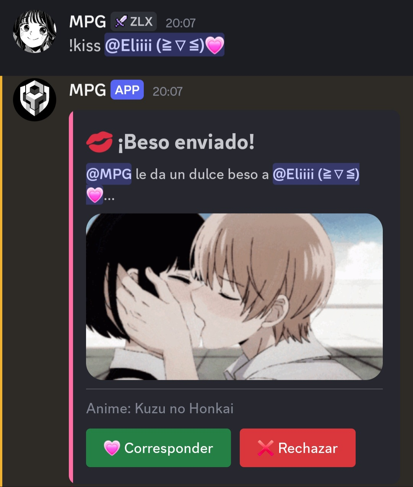
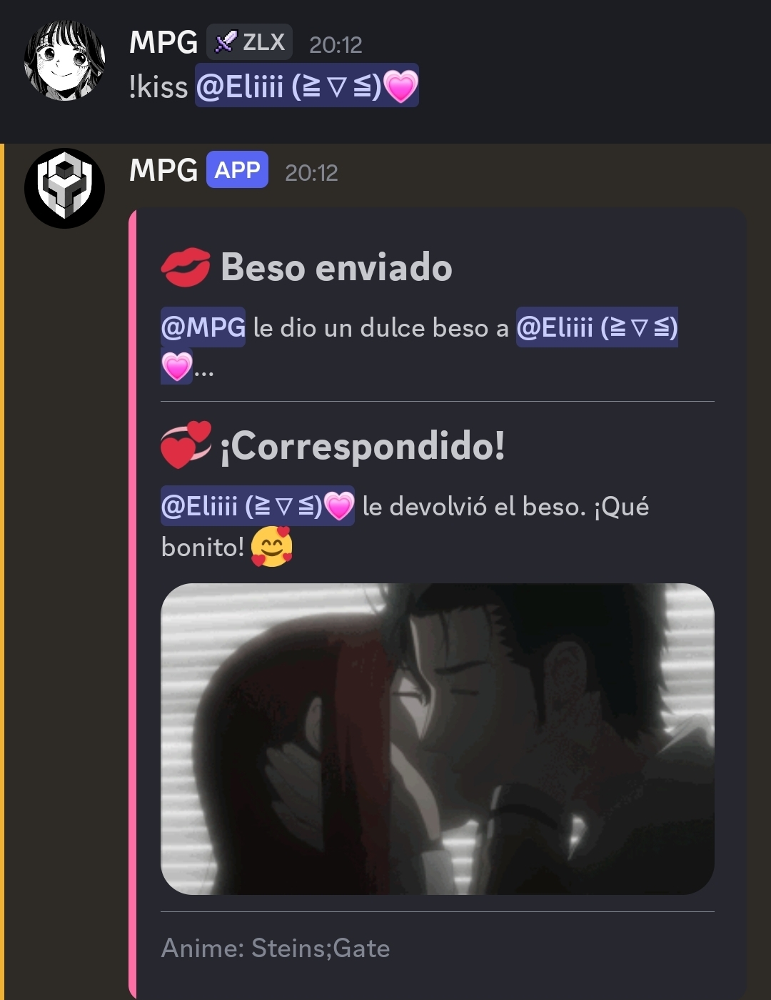
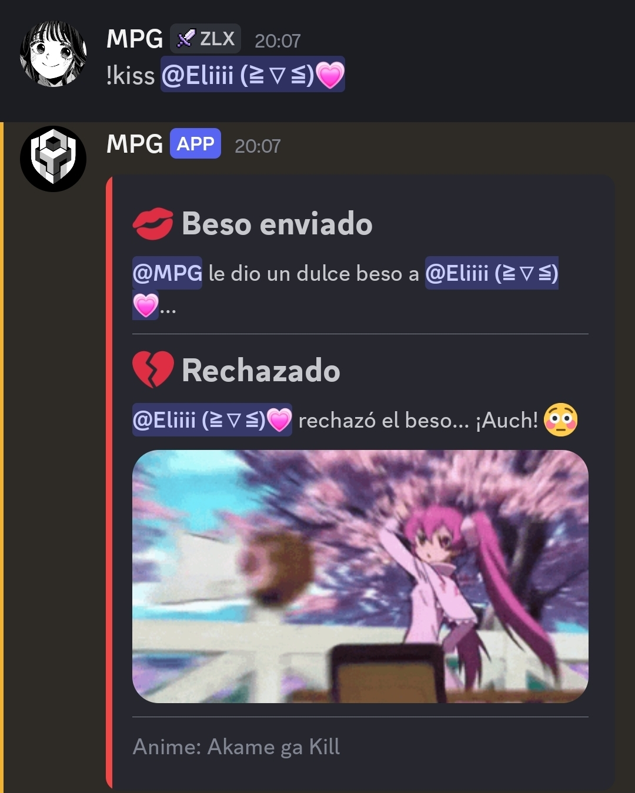

# Sistema `!kiss` estilo Nekotina — BDFD + Components V2

Sistema de comando `!kiss @usuario` para BDFD, con embed CV2, GIFs de la API de nekos.best, y botones de "Corresponder ❤️" / "Rechazar ❌" que solo puede pulsar el usuario mencionado.

---

## 📁 Estructura del proyecto

```
Assents/         → capturas de pantalla reales usadas en este README
Codigos/
  !kiss.md       → código del comando !kiss (bloque bash)
  $onInteraction.md → código del callback de botones (bloque bash)
README.md        → este archivo
```

---

## 💋 Flujo 1 — Enviar el beso (`!kiss @usuario`)

El comando valida que se haya mencionado a alguien, que no sea el propio autor, y que no sea un bot. Si todo es correcto, llama a `https://nekos.best/api/v2/kiss`, arma un contenedor CV2 con el gif, el nombre del anime (extraído del JSON, nunca inventado) y dos botones.



Código completo: [`Codigos/!kiss.md`](Codigos/!kiss.md)

---

## 💞 Flujo 2 — Corresponder

Solo el usuario mencionado puede pulsar "💗 Corresponder". Al hacerlo, se llama de nuevo a la API de kiss y el mensaje se actualiza agregando el resultado debajo del resumen original, sin la fila de botones.



> ⚠️ Esta captura es un **marcador temporal**: este flujo concreto (botón Corresponder) todavía no se confirmó funcionando en Discord durante las pruebas — solo se verificó el flujo de Rechazar. Reemplázala en cuanto lo pruebes con éxito.

---

## 💔 Flujo 3 — Rechazar

Solo el usuario mencionado puede pulsar "❌ Rechazar". Llama a `https://nekos.best/api/v2/slap` y actualiza el mensaje agregando el resultado de rechazo debajo, con su propio gif y su propio footer de anime.



Código completo: [`Codigos/$onInteraction.md`](Codigos/$onInteraction.md)

---

## ⚠️ Limitaciones documentadas (verificadas contra la documentación oficial)

1. **Components V2 es una función "nightly" (beta)** de BDFD, no estable — confirmado porque las funciones CV2 (`$addContainer`, `$addButtonCV2`, etc.) solo aparecen en el changelog *nightly* de la wiki, no en el estable. Tu bot necesita el canal Nightly activado.
2. **La API `api.nekos.best/v3/...` no existe.** Solo hay v2 mantenida (confirmado en `docs.nekos.best`). Se usó `https://nekos.best/api/v2/kiss` y `.../slap`.
3. **CV2 no tiene "footer" nativo.** Se simula con `$addTextDisplay` usando el prefijo de texto pequeño de Discord (`-# `).
4. **`$elseif[]` requiere BDScript 2.**
5. **`$ephemeral`** está documentado solo para respuestas de slash command; no hay confirmación oficial de que aplique igual dentro de `$onInteraction` — probado empíricamente en este proyecto.
6. El sistema usa un `$onInteraction` genérico (sin ID fijo) porque el ID del botón es dinámico (incluye el ID del usuario objetivo). Si tu bot ya tiene otro sistema con `$onInteraction`, **debes fusionar el código en el mismo bloque**, con tus propios prefijos únicos, para evitar interferencias (esto se detectó y corrigió durante las pruebas: un sistema `!snake` externo reaccionaba a los botones de `!kiss` porque no filtraba por su propio prefijo).

---

## 🧪 Historial de pruebas reales (resumen)

Durante el desarrollo se detectaron y corrigieron, en orden:
- `\n` literal en los textos (BDFD no interpreta el escape `\n`; se sustituyó por saltos de línea reales).
- Interferencia con un `$onInteraction` externo (`!snake`) por falta de filtro de prefijo propio.
- El botón se quedaba en estado de carga (`...`) porque `$channelSendMessage` fallaba al recibir texto vacío.
- Los intentos de forzar un mensaje **nuevo** (`$channelSendMessage`, `$reply`) no lograron adjuntar el contenedor CV2 — solo se adjuntaba a la actualización implícita del mensaje original.
- **Solución final:** aceptar el comportamiento real de BDFD (actualiza el mensaje original) y reconstruir el contenedor completo con el resumen arriba y el resultado abajo, eliminando la fila de botones al reconstruir.

---

## Instalación

1. Activa el canal **Nightly** de BDFD.
2. Crea el comando `!kiss` en **BDScript 2** con el código de [`Codigos/!kiss.md`](Codigos/!kiss.md).
3. Crea (o fusiona con uno existente) el callback `$onInteraction` con el código de [`Codigos/$onInteraction.md`](Codigos/$onInteraction.md).
4. Prueba los 3 mensajes de error, y luego ambos botones con el usuario correcto y con otro usuario distinto.
